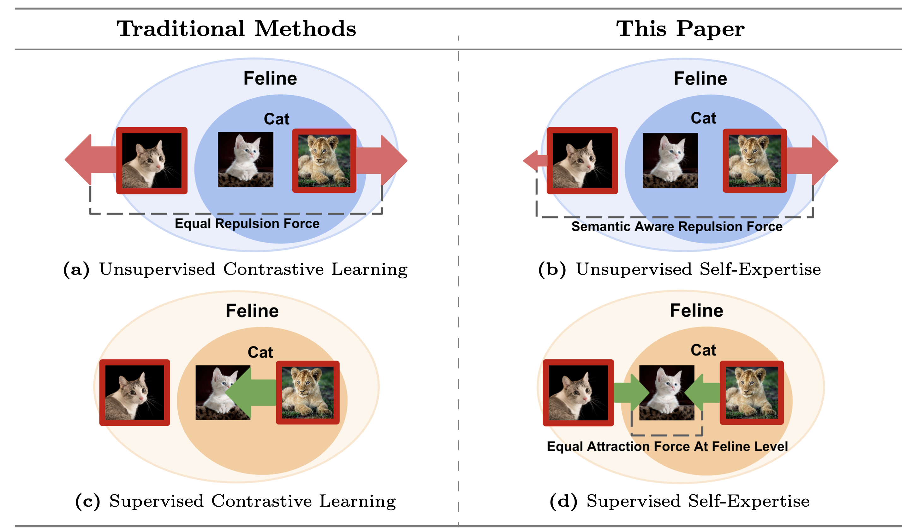

# SelEx: Self-Expertise in Fine-Grained Generalized Category Discovery


<p align="center">
    <a href="https://www.arxiv.org/abs/2408.14371"></a>
    <a href="https://www.arxiv.org/abs/2408.14371"></a>
</p>

<p align="center">
	SelEx: Self-Expertise in Fine-Grained Generalized Category Discovery (ECCV 2024)<br>
  By
  <a href="https://sarahrastegar.github.io/">Sarah Rastegar</a>, 
  <a href="https://smsd75.github.io/">Mohammadreza Salehi</a>, 
  <a href="https://yukimasano.github.io/">Yuki Asano</a>, 
  <a href="https://hazeldoughty.github.io/">Hazel Doughty</a>, and 
  <a href="https://www.ceessnoek.info/">Cees Snoek</a>.
</p>




## Dependencies

```
pip install -r requirements.txt
```

### kmeans_pytorch Installation
Since our work relies heavily on [kmeans_pytorch](https://github.com/subhadarship/kmeans_pytorch) for cluster assignments, you need to ensure that it is correctly imported to reproduce the results from the paper. You can install `kmeans_pytorch` directly in the directory by executing the following commands:

```
cd SelEx
git clone https://github.com/subhadarship/kmeans_pytorch
cd kmeans_pytorch
pip install --editable .
```

**Note:** While using `scikit-learn`'s KMeans provides improvements, the results in the paper have been reported using `kmeans_pytorch`.

## Config

Set paths to datasets, pre-trained models and desired log directories in ```config.py```

Set ```SAVE_DIR``` (logfile destination) and ```PYTHON``` (path to python interpreter) in ```bash_scripts``` scripts.

## Datasets

We use fine-grained benchmarks in this paper, including:                                                                                                                    
                                                                                                                                                                  
* [The Semantic Shift Benchmark (SSB)](https://github.com/sgvaze/osr_closed_set_all_you_need#ssb) and [Herbarium19](https://www.kaggle.com/c/herbarium-2019-fgvc6)

We also use generic object recognition datasets, including:

* [CIFAR-10/100](https://pytorch.org/vision/stable/datasets.html) and [ImageNet](https://image-net.org/download.php)


## Scripts

**Train representation**:
To run the code with the hyperparameters used in the paper, execute the following command:

```
python contrastive_training.py
```
This script will automatically train the representations, extract features, and fit the semi-supervised KMeans algorithm. It also provides final evaluations on both the best checkpoint and the final checkpoint.


## <a name="cite"/> :clipboard: Citation

If you use this code in your research, please consider citing our paper:

```
@inproceedings{RastegarECCV2024,
title = {SelEx: Self-Expertise in Fine-Grained Generalized Category Discovery},
author = {Sarah Rastegar and Mohammadreza Salehi and Yuki M Asano and Hazel Doughty and Cees G M Snoek},
year = {2024},
booktitle = {European Conference on Computer Vision},
}
```

## Acknowledgements

The codebase is mainly built on the repo of https://github.com/sgvaze/generalized-category-discovery. 

